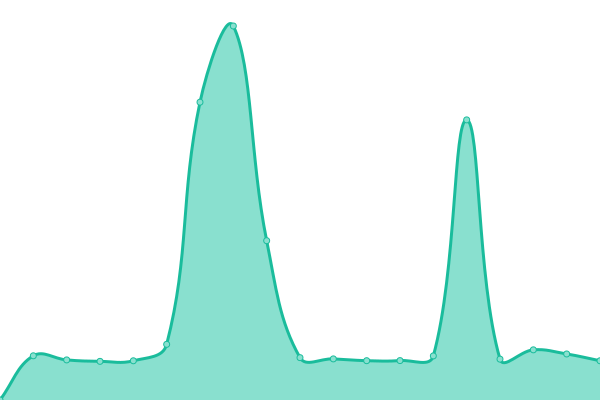
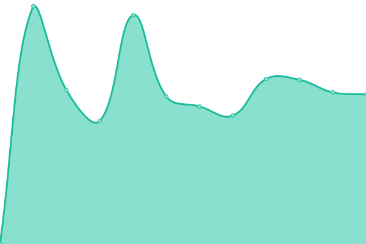
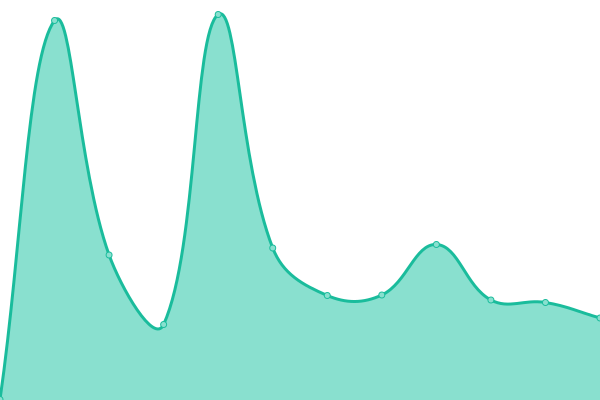

# [📈 Live Status](https://brotoo25.github.io/pco-sites-upptime): <!--live status--> **🟧 Partial outage**

This repository contains the open-source uptime monitor and status page for [Broto](https://brotoo25.github.io/pco-sites-upptime), powered by [Upptime](https://github.com/upptime/upptime).

With [Upptime](https://upptime.js.org), you can get your own unlimited and free uptime monitor and status page, powered entirely by a GitHub repository. We use [Issues](https://github.com/brotoo25/pco-sites-upptime/issues) as incident reports, [Actions](https://github.com/brotoo25/pco-sites-upptime/actions) as uptime monitors, and [Pages](https://brotoo25.github.io/pco-sites-upptime) for the status page.

<!--start: status pages-->
<!-- This summary is generated by Upptime (https://github.com/upptime/upptime) -->
<!-- Do not edit this manually, your changes will be overwritten -->
<!-- prettier-ignore -->
| URL | Status | History | Response Time | Uptime |
| --- | ------ | ------- | ------------- | ------ |
|  [Causa Operaria](https://causaoperaria.org.br/) | 🟩 Up | [causa-operaria.yml](https://github.com/brotoo25/pco-sites-upptime/commits/HEAD/history/causa-operaria.yml) | 

 6446ms
     
 | 

<a href="https://brotoo25.github.io/pco-sites-upptime/history/causa-operaria">69.43%</a>
    

|  [PCO - Partido da Causa Operaria](https://pco.org.br/) | 🟩 Up | [pco-partido-da-causa-operaria.yml](https://github.com/brotoo25/pco-sites-upptime/commits/HEAD/history/pco-partido-da-causa-operaria.yml) | 

 1066ms
     
 | 

<a href="https://brotoo25.github.io/pco-sites-upptime/history/pco-partido-da-causa-operaria">70.36%</a>
    

|  [COTV - Causa Operaria TV](https://cotv.org.br/) | 🟩 Up | [cotv-causa-operaria-tv.yml](https://github.com/brotoo25/pco-sites-upptime/commits/HEAD/history/cotv-causa-operaria-tv.yml) | 

 493ms
     
 | 

<a href="https://brotoo25.github.io/pco-sites-upptime/history/cotv-causa-operaria-tv">70.38%</a>
    

|  [Universidade Marxista](https://universidademarxista.pco.org.br) | 🟥 Down | [universidade-marxista.yml](https://github.com/brotoo25/pco-sites-upptime/commits/HEAD/history/universidade-marxista.yml) | 

 0ms
     
 | 

<a href="https://brotoo25.github.io/pco-sites-upptime/history/universidade-marxista">0.01%</a>
    

<!--end: status pages-->

[**Visit our status website →**](https://brotoo25.github.io/pco-sites-upptime)

## 📄 License

- Powered by: [Upptime](https://github.com/upptime/upptime)
- Code: [MIT](./LICENSE) © [Anand Chowdhary](https://anandchowdhary.com), supported by [Pabio](https://pabio.com)
- Data in the `./history` directory: [Open Database License](https://opendatacommons.org/licenses/odbl/1-0/)
